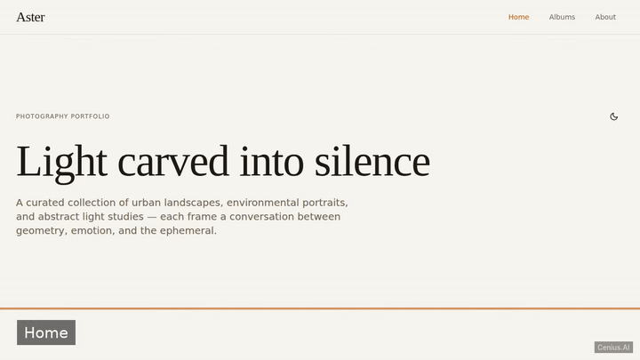
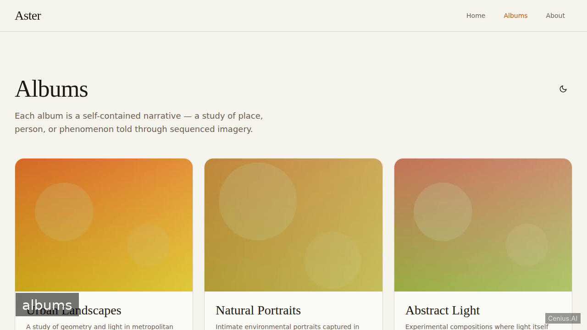
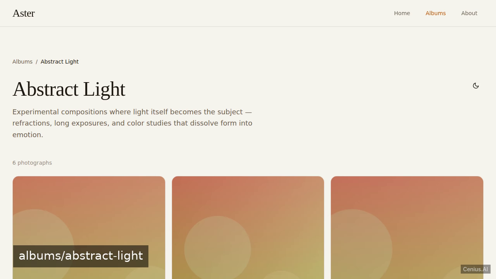

# Aster — Node.js photography web application reference implementation

A photographers photo gallery/portfolio website built with Fresh (Deno/TS). That's **Aster** — a Apache-2.0-licensed, open-source photography web application in Node.js you can self-host and modify freely. Fork Aster, run it, or [remix it on cenius.ai](https://cenius.ai/marketplace/p/aster?ref=gh&utm_campaign=aster-nodejs) for a custom Aster build with full rebrand rights.


[](LICENSE)  [](https://cenius.ai)

[](https://cenius.ai/marketplace/p/aster?ref=gh&utm_campaign=aster-nodejs)

> **▶ [Open & edit in cenius.ai](https://cenius.ai/marketplace/p/aster?ref=gh&utm_campaign=aster-nodejs)** — one click to an editable workspace: describe changes in plain English, get an instant preview, one-click deploy and host. Modifications made on the platform come with full rebrand & relicense rights.

_Local clone? See [Quick start](#quick-start) below. cenius.ai is the zero-setup path._

## Demo



▶ **[Watch the full demo video](https://cenius.ai/marketplace/p/aster?ref=gh&utm_campaign=aster-nodejs)** — the complete walkthrough, playing on the project's cenius.ai page · [MP4 file](.github/media/demo.mp4)

## Screenshots

  

## Quick start

```bash
./install.sh   # installs dependencies + seeds demo data
```

See [`INSTALL.md`](INSTALL.md) for full setup and usage instructions.

## Usage guide

### Browsing the portfolio

#### Home page (`/`)
The landing page introduces Aster with an oversized editorial headline and
three album cards. Each card shows a gradient placeholder representing the
album's visual style.

#### Albums gallery (`/albums`)
Lists all albums in a responsive grid. Click any album card to enter its
detail view.

#### Album detail (`/albums/:id`)
Displays every photo in the album in a masonry-style grid. Each photo
shows a caption on hover.

#### Lightbox
Click any photo to open the full‑size lightbox viewer. Navigate between
photos with:
- **Arrow keys** (← →)
- **On‑screen buttons** (prev / next)
- **Escape** to close

#### Dark mode
Toggle light/dark themes via the sun/moon icon in the top‑right of every
page. Your preference is saved to `localStorage` and restored on return.

The initial theme respects your OS `prefers-color-scheme` setting on first
visit.

### Keyboard shortcuts

| Key | Action |
|-----|--------|
| `←` / `→` | Navigate lightbox photos |
| `Escape` | Close lightbox |

### Accessibility

- All images have descriptive `alt` text
- Full keyboard navigation support
- Visible focus rings on all interactive elements
- Semantic HTML landmarks (`<nav>`, `<main>`, `<footer>`)
- Respects `prefers-reduced-motion`

### Responsive design

The layout adapts to mobile (320px+), tablet, and desktop widths.
Touch targets meet 44×44px minimum on all interactive controls.

_Full guide: [`USAGE.md`](USAGE.md)_

## Features

- Album listing
- Album detail page
- Responsive layout
- Light/Dark mode toggle
- About page
- Custom 404 page

## Architecture

A self-contained Node.js project (50 files): top-level directories include `components/`, `data/`, `islands/`, `routes/`, `static/`, `utils/`. Dependency management and data seeding are both handled by `./install.sh` — run it once, then start the server. See [`INSTALL.md`](INSTALL.md) for complete setup instructions.

## FAQ

### What's the quickest way to self-host Aster?

`git clone` + `./install.sh` gets you a running instance — the install script provisions dependencies and demo data. Full steps live in [`INSTALL.md`](INSTALL.md); nothing external is needed to try it.

### Which framework or language does Aster use?

Node.js end-to-end. Every file you need to run the app is here in this repository — code, configuration, seed data. Highlights include about page.

### Does the Aster license allow commercial use?

Yes — Apache-2.0-licensed, so commercial use, modification, and distribution are all permitted. Read the full terms in [LICENSE](LICENSE).

### How do I make Aster my own brand?

Yes. The MIT license lets you remove the original branding and ship under your own name. For a guided approach, [remix it on cenius.ai](https://cenius.ai/marketplace/p/aster?ref=gh&utm_campaign=aster-nodejs): you get a fresh build with full rebrand and relicense rights.

### Can I change Aster without writing code?

Describe what you want changed on [cenius.ai](https://cenius.ai/marketplace/p/aster?ref=gh&utm_campaign=aster-nodejs) — no code editing needed; the platform produces a fresh build you can download and deploy.

## License & rebranding

Released under the [Apache License 2.0](LICENSE) (© 2026 Cenius AI) — free for personal and commercial use. The Cenius name/logo are trademarks (see NOTICE).

**Need a customized version?** [Remix this app on cenius.ai](https://cenius.ai/marketplace/p/aster?ref=gh&utm_campaign=aster-nodejs) — modifications made on the platform come with **full rebrand & relicense rights** over your derivative.

## Built with cenius.ai

This entire application — code, design, seeded demo data — was generated on **[cenius.ai](https://cenius.ai)** from a plain-English description.

- 🚀 [Build your own app on cenius.ai](https://cenius.ai)
- 🎛️ [Remix Aster on the marketplace](https://cenius.ai/marketplace/p/aster?ref=gh&utm_campaign=aster-nodejs) — open it in a workspace, prompt for changes, and ship your own version.

More open-source apps: [the Cenius-ai catalog](https://github.com/Cenius-ai) · [showcase index](https://github.com/Cenius-ai/showcase)
